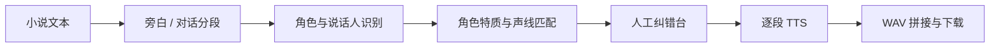

# 声场 VoxCast

> 把中文小说自动拆成旁白与角色台词，生成角色卡、匹配不同声线，并在人工确认后合成多角色听书。

[](https://github.com/mungbean138516-jpg/multi-character-_text_to_speech/actions/workflows/ci.yml)

当前版本是可现场演示的 `0.1 MVP`。它不训练 TTS 模型，而是把真正困难且有产品价值的中间层做出来：



## 现在已经能做什么

- 粘贴中文小说，支持 `“”`、`「」`、`『』` 和英文双引号。
- 离线识别 `张三说：“……”`、`“……”张三问道`、`林夏笑了笑：“……”` 等常见句式。
- 将旁白和人物分开，推断有证据支持的年龄段、性别呈现、声音特质与当前情绪。
- 低置信度结果明确标黄或标红，不把猜测伪装成事实。
- 自动从同一 CosyVoice 模型的兼容音色库中选角，避免跨模型混用 voice ID。
- 网页中修改角色名、年龄、性别呈现、声线和每句台词的说话人。
- 无 API Key 时，使用浏览器 Web Speech API 做真实多人试听。
- 无 API Key 时，使用离线诊断音跑通服务端“逐段生成 → 插入停顿 → 拼接 → 下载 WAV”。
- 配置百炼后，调用真实 CosyVoice HTTP API 并立即下载供应商的临时音频。
- 可选用千问增强别名、指代和隐含说话人的识别；失败时自动退回本地规则结果。
- 零 Python 第三方运行依赖，现场机器只需要 Python 3.10+。

## 30 秒启动

```bash
git clone https://github.com/mungbean138516-jpg/multi-character-_text_to_speech.git
cd multi-character-_text_to_speech
python3 -m audiobook_app
```

浏览器打开 [http://127.0.0.1:8000](http://127.0.0.1:8000)，然后：

1. 点击“载入原创演示文本”。
2. 点击“开始选角”。
3. 检查并修改角色卡或台词归属。
4. 点击“浏览器多人试听”。
5. 点击“生成离线链路检测音”，验证音频拼接与下载。

也可以直接分析文件：

```bash
python3 -m audiobook_app analyze examples/demo_chapter.txt
```

## 连接阿里云百炼

密钥只能放在服务端环境变量中，不能写进 `app.js`、Git、浏览器 `localStorage` 或日志。

```bash
export DASHSCOPE_API_KEY="your-api-key"
export DASHSCOPE_WORKSPACE_ID="your-workspace-id"
export DASHSCOPE_LLM_BASE_URL="https://YOUR_WORKSPACE_ID.cn-beijing.maas.aliyuncs.com/compatible-mode/v1"
export DASHSCOPE_LLM_MODEL="qwen3.7-flash"
export DASHSCOPE_TTS_MODEL="cosyvoice-v3-flash"

python3 -m audiobook_app
```

也可参考 `.env.example`。本项目刻意不自动读取 `.env`，避免误把文件暴露或让现场环境行为不透明；使用 Docker、IDE 或进程管理器时，让它负责注入环境变量即可。

百炼当前的非实时语音合成接口是：

```text
POST https://{WorkspaceId}.cn-beijing.maas.aliyuncs.com/api/v1/services/audio/tts/SpeechSynthesizer
Authorization: Bearer <DASHSCOPE_API_KEY>
```

官方将 HTTP 模式定位为有声阅读和音频内容制作场景。返回的完整音频 URL 只有有限有效期，所以适配器会立即下载并保存 WAV。参考：

- [百炼非实时 TTS HTTP API](https://help.aliyun.com/zh/model-studio/cosyvoice-tts-http-api)
- [百炼语音合成模型选型](https://help.aliyun.com/zh/model-studio/tts-model/)
- [CosyVoice 音色列表](https://help.aliyun.com/en/model-studio/cosyvoice-voice-list)
- [千问 OpenAI 兼容接口](https://help.aliyun.com/zh/model-studio/compatibility-of-openai-with-dashscope)

默认 TTS 模型与 voice ID 都在环境变量和 `audiobook_app/voices.py` 中集中管理。供应商模型更新或下线时，不需要改业务流程。

## 用户到底要不要自己买 Token？

不一定。产品有两种正常模式：

| 模式 | 用户体验 | 费用归属 | 适合阶段 |
|---|---|---|---|
| 平台统一 Key | 用户直接上传文本、购买应用内积分 | 团队向供应商付费 | 正式消费产品，体验最好 |
| BYOK | 用户在安全设置中绑定自己的供应商 Key | 用户直接向供应商付费 | 开发者工具、内测 |

本 MVP 用团队自己的服务端 Key 最省事，普通用户不需要理解 Token。正式上线后建议采用“平台积分为默认，BYOK 为高级选项”；无论哪一种，永久 Key 都不能到达浏览器。

## 目录

```text
audiobook_app/
  analyzer.py       离线文本分段与说话人基线
  qwen.py           千问 JSON 增强与安全降级
  voices.py         语义特征到供应商音色的确定性映射
  audio.py          分段渲染、WAV 校验、停顿与拼接
  server.py         零依赖网页与 JSON API
  providers/
    base.py         TTS 统一接口
    demo.py         离线诊断音适配器
    dashscope.py    百炼非实时 TTS 适配器
web/
  index.html        单页工作台
  styles.css        响应式界面
  app.js            角色纠错、浏览器试听、生成控制
tests/              全离线单元测试
examples/           原创演示文本
docs/               PRD、架构、路线、演示与 Qoder 记录
```

## API

| 方法 | 路径 | 作用 |
|---|---|---|
| `GET` | `/api/health` | 健康检查 |
| `GET` | `/api/config` | 可用分析器、TTS、声线和限制；不返回密钥 |
| `POST` | `/api/analyze` | 文本 → 角色卡与台词轨道 |
| `POST` | `/api/render/plan` | 生成前统计片段和计费字符数 |
| `POST` | `/api/render` | 使用离线或百炼 provider 生成并拼接 WAV |

完整数据合同见 [docs/ARCHITECTURE.md](docs/ARCHITECTURE.md)。

## 测试

```bash
python3 -m unittest discover -s tests -v
python3 -m compileall -q audiobook_app
```

测试不访问外网、不消耗 API 额度，覆盖：

- 前置、后置和动作式说话人；
- 老人、儿童角色类型；
- 无对话文本的旁白降级；
- 人物特质不从相邻角色错误借用；
- 声线年龄与性别匹配；
- WAV 参数检查、静音插入、完整任务输出；
- 调用前的字符限额。

## 稳定演示

任务书要求的 2 分钟以上现场 Demo 已写成逐步脚本：

- [演示脚本](docs/DEMO_SCRIPT.md)
- [1.5 天冲刺与七人分工](docs/DEVELOPMENT_ROADMAP.md)
- [Qoder Prompt 与留痕模板](docs/QODER_LOG.md)

PPT 暂未制作，等系统版本与团队分工确认后再从真实 Demo 截图生成。

## 当前边界

这一版故意不做“整本书全自动”：

- 规则分析适合明确说话人句式；复杂别名、跨章指代和自由间接引语需要千问与人工确认。
- 引号解析目前是轻量正则基线，复杂嵌套引号将在下一版改为堆栈解析器。
- 浏览器试听依赖操作系统安装的中文声音，音质和声线数量因设备而异。
- 服务端诊断音是可区分的音调，不冒充真实 TTS。
- 当前输出为 WAV；MP3、EPUB、任务队列、缓存和断点续跑放在后续阶段。
- 不提供小说网站抓取。只处理用户自有、已授权或公版文本。
- 不开放声音克隆；未来加入时必须核验被克隆者授权，并禁止仿冒公众人物。

## 文档导航

- [产品需求 PRD](docs/PRD.md)
- [系统架构](docs/ARCHITECTURE.md)
- [开发路线与团队分工](docs/DEVELOPMENT_ROADMAP.md)
- [真实 API 接入与计费设计](docs/API_INTEGRATION.md)
- [现场演示脚本](docs/DEMO_SCRIPT.md)
- [Qoder 使用记录](docs/QODER_LOG.md)
- [贡献指南](CONTRIBUTING.md)


## Git Test
Testing write access from Keming-Hu.
