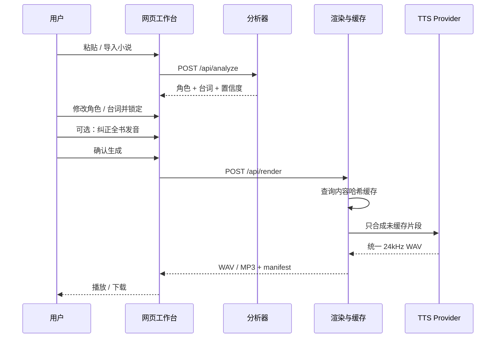

# 系统架构与数据合同

## 架构原则

1. **规则先行，模型补语义。** 引号和明确发言动词由确定性代码处理；别名与指代交给千问。
2. **不确定性是数据。** `confidence` 和 `evidence` 会进入 UI，不在后端静默吞掉。
3. **角色特质与台词情绪分开。** “温暖的成年女声”是角色基线，“愤怒”是当前一句的状态。
4. **LLM 不直接选择 voice ID。** 模型输出语义标签，由 `voices.py` 匹配供应商目录。
5. **真实 API 可拔插。** 业务管线只依赖 `TTSProvider.synthesize()`。
6. **先下载，再拼接。** 百炼返回的临时 URL 不作为项目长期资源。
7. **编辑优先于再猜。** 人工修改进入 `locked`，重复角色可并入同一 alias 档案。
8. **缓存按内容而不是序号。** 文本、情绪、voice 与 provider 配置共同决定缓存键。
9. **显示文本与朗读文本分离。** 发音词典只改变送入语音服务的 `spoken_text`，不改小说原文。
10. **技术复杂度不进入主流程。** provider、缓存键、请求数和诊断音只面向开发者。

## 请求链路



## 模块边界

### `analyzer.py`

输入：已经解码成 Unicode 的原始文本。

输出：`AnalysisResult`。

职责：

- 规范换行；
- 用配对堆栈识别引号内对话与嵌套引号；
- 保留字符位置；
- 识别发言动词前后的候选人物；
- 生成本地置信度；
- 只在文本有证据时推断年龄和性别呈现。

### `qwen.py`

输入：原文 + 本地分段结果。

职责：

- 用 OpenAI 兼容 HTTP 接口请求严格 JSON；
- 让小说文本始终处于“数据”位置，系统提示不接受原文中的指令；
- 合并角色、aliases 和 speaker assignment；
- 网络、鉴权或 JSON 失败时保留本地结果。

### `voices.py`

输入：角色的 `gender`、`age_group`、`traits`。

输出：固定目录中的 `voice_id`。

目录项同时保存：

- 应用内部 ID；
- 供应商 voice 参数；
- 模型兼容的性别与年龄；
- 浏览器试听的 rate / pitch；
- 离线诊断音频率。

所有 `provider_voice` 当前都属于 `cosyvoice-v3-flash`，禁止与其他模型混用。

### `providers/`

统一接口：

```python
synthesize(
    segment: ScriptSegment,
    character: CharacterProfile,
    voice: VoicePreset,
    output_path: Path,
) -> dict
```

- `DemoToneProvider`：全离线，不假装语音，只验证音频管线。
- `DashScopeTTSProvider`：百炼非实时 HTTP，一句一请求，立即下载 WAV。

### `audio.py`

- 合成前检查字符和片段限制；
- 根据 provider、文本、情绪和 voice 生成 SHA-256 缓存键；
- 将全书发音词典应用到朗读副本，最长词优先且不级联替换；
- 预算阶段统计缓存命中、未缓存请求与计费字符；
- 单段失败时保留其他成功缓存，重新提交只合成缺失片段；
- 支持只把一个 `ScriptSegment` 送入同一渲染与缓存管线；
- 创建隔离 job 目录；
- 校验所有 WAV 的通道、位深和采样率；
- 片段间插入 220ms 静音；
- 写入 `audiobook.wav`、可选 `audiobook.mp3` 与 `manifest.json`。

### `textio.py`

- 识别 UTF-8 BOM、UTF-16 LE / BE；
- 无 BOM 时先尝试 UTF-8，再尝试 GB18030；
- 拒绝控制字符比例异常的二进制输入。

浏览器端实现相同的 TXT 解码顺序，服务端 CLI 则复用该模块。

## 核心数据

### CharacterProfile

```json
{
  "id": "char_123",
  "name": "林夏",
  "aliases": ["小夏"],
  "gender": "unknown",
  "age_group": "unknown",
  "traits": ["轻柔"],
  "voice_id": "adult_f_soft",
  "confidence": 0.62,
  "evidence": ["林夏轻声说"],
  "locked": true
}
```

`unknown` 是正常值。没有证据时不根据中文姓名强行推断性别或年龄。

### ScriptSegment

```json
{
  "id": "seg_004",
  "kind": "dialogue",
  "text": "总得有人把信送到。",
  "speaker_id": "char_123",
  "emotion": "neutral",
  "confidence": 0.92,
  "source_start": 56,
  "source_end": 65,
  "locked": true
}
```

### AnalysisResult 发音词典

```json
{
  "pronunciations": {
    "单雄信": "善雄信",
    "甄宓": "甄福"
  }
}
```

界面显示和 manifest 的 `segment.text` 始终保留原文。供应商实际收到的文本写入 manifest 的可选 `spoken_text` 字段。发音规则变化只会让包含该词的片段产生新的内容缓存键。

### 单句重做

```text
POST /api/render/segment
```

请求包含完整项目数据和一个 `segment_id`。服务端验证该 ID、抽出对应句子并复用与整书完全相同的 provider、费用确认、重试、WAV 校验和缓存逻辑；它不是另一套特殊音频实现。

### 输出目录

```text
data/outputs/<job_id>/
  audiobook.wav
  audiobook.mp3
  manifest.json
  segments/
    001_seg_001.wav
    002_seg_002.wav

data/outputs/_cache/
  ab/
    <sha256>.wav
```

该目录已加入 `.gitignore`。

## 下一轮技术改造

- EPUB 章节解析与项目 JSON 导入 / 导出；
- 做跨章节角色 alias 图谱与 `locked` 继承；
- 将相邻同角色短句合并，降低 API 调用次数；
- 加后台队列、任务进度和跨进程失败恢复；
- 首批句子完成后即可播放；
- 记录片段起止时间，生成 WebVTT / LRC；
- 输出 M4B、封面与章节元数据。
