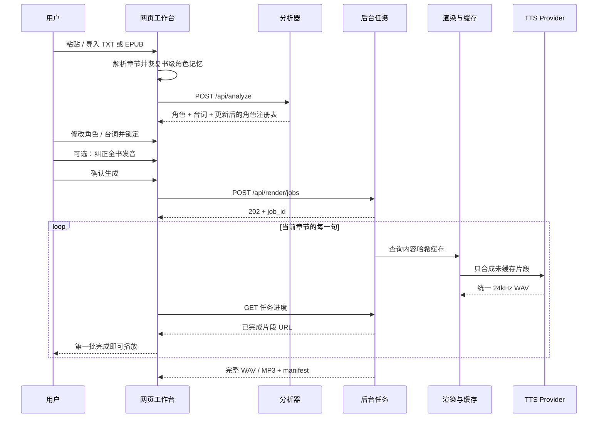

# 系统架构与数据合同

## 架构原则

1. **规则先行，模型补语义。** 引号和明确发言动词由确定性代码处理；复杂台词归属由千问给建议，用户随时可以纠错。
2. **不确定性是数据。** `confidence` 和 `evidence` 会进入 UI，不在后端静默吞掉。
3. **角色特质与台词情绪分开。** “温暖的成年女声”是角色基线，“愤怒”是当前一句的状态。
4. **LLM 不直接选择 voice ID。** 模型输出语义标签，由 `voices.py` 匹配供应商目录。
5. **真实 API 可拔插。** 业务管线只依赖 `TTSProvider.synthesize()`。
6. **先下载，再拼接。** 百炼返回的临时 URL 不作为项目长期资源。
7. **编辑优先于再猜。** 人工修改进入 `locked`，重复角色可并入同一 alias 档案。
8. **缓存按内容而不是序号。** 文本、情绪、voice 与 provider 配置共同决定缓存键。
9. **显示文本与朗读文本分离。** 发音词典只改变送入语音服务的 `spoken_text`，不改小说原文。
10. **技术复杂度不进入主流程。** provider、缓存键和请求数只面向开发者；内部诊断音不出现在用户界面。
11. **章节是工作单元，书籍是记忆边界。** 单次分析只处理当前章，角色与发音规则保存在 `BookProject`。
12. **人工判断跨章优先。** `locked` 角色的姓名、类型与声音不会被后续章节的模型猜测覆盖。
13. **长篇输入先做安全解析。** EPUB 在进入分析器前限制压缩包路径、文件数、解压大小和异常压缩比。
14. **免费体验与正式供应商分层。** 免 Key Neural 适配器用于原型验证，Mac 系统声音负责断网兜底；商业版本使用有明确 SLA 的 TTS。
15. **免费角色少而精。** 自动选角只使用旁白、小女孩、小男孩、成年女性和成年男性 5 类经过筛选的 Neural 声线；成年声使用原生音高，儿童只做轻微童声调节，老人自然回退到对应性别的成年声。
16. **试听与生成使用同一适配器。** 免费角色卡调用 Neural 单句生成并复用缓存；高级角色只有在付费服务已连接后才能选择，产生新请求前必须确认费用。
17. **长文本交互先检索，后推理。** 角色对话在本地按人物、别名、证据和问题选取有关片段，不在每轮把整本书发送至外部模型；页面显示实际发送规模。
18. **文字交互不依赖语音成功。** 角色回复先保存文字；Neural 音频失败时降级到设备声音，不丢弃已经生成的回复。

## 请求链路



## 模块边界

### `analyzer.py`

输入：已经解码成 Unicode 的原始文本。

输出：`AnalysisResult`。

职责：

- 规范换行；
- 用配对堆栈识别引号内对话与嵌套引号；
- 保留字符位置；
- 识别发言动词前后的候选人物；
- 生成本地置信度；
- 只在文本有证据时推断年龄和性别呈现。

### `qwen.py`

输入：角色分析时使用原文 + 本地分段结果；角色对话时使用 `chat.py` 选出的相关原文片段。

职责：

- 用 OpenAI 兼容 HTTP 接口请求严格 JSON；
- 让小说文本始终处于“数据”位置，系统提示不接受原文中的指令；
- 合并角色、aliases 和 speaker assignment；
- 网络、鉴权或 JSON 失败时保留本地结果。
- 角色对话回复限制长度，证据不足时不声称知道原文之外的事实。

### `chat.py`

- 将超长原文按段落与句末分成可控片段；
- 用角色名、别名、人物证据和当前问题关键词进行确定性打分；
- 为命中片段补上相邻叙事上下文，并保留一个简短开场摘要；
- 默认硬限制为 12,000 字符，可用 `APP_MAX_CHAT_CONTEXT_CHARACTERS` 在 1,500–30,000 之间调整；
- 返回原文字符、实际发送字符、片段数和是否截断的公开摘要，不在摘要中复制原文。

### `voices.py`

输入：角色的 `gender`、`age_group`、`traits`。

输出：固定目录中的 `voice_id`。

目录项同时保存：

- 应用内部 ID；
- 供应商 voice 参数；
- 模型兼容的性别与年龄；
- 浏览器试听的 rate / pitch；
- 内部测试音频率。

所有 `provider_voice` 当前都属于 `cosyvoice-v3-flash`，禁止与其他模型混用。
目录通过 `access` 分为 5 个免费精选角色和高级角色。自动选角只从免费
目录取声线；0.9 以前自动分配且尚未人工锁定的高级声线会迁移到免费目录，
人工锁定的选择仍会保留。
浏览器试听只把 rate / pitch 作为温和近似，并优先选择标准中文系统
人声；不会再用极端音高或系统效果音模拟儿童和老人。

### `providers/`

统一接口：

```python
synthesize(
    segment: ScriptSegment,
    character: CharacterProfile,
    voice: VoicePreset,
    output_path: Path,
) -> dict
```

- `MacOSLocalTTSProvider`：使用 Mac 已安装的中文系统声音，输出统一
  24kHz 单声道 WAV；免费、可缓存、可拼接和导出。
- `NeuralVoicePackProvider`：通过免 Key 在线中文 Neural 声线生成 MP3，
  再用 `miniaudio` 解码为 24kHz 单声道 WAV；声音更自然，但需要联网，
  只定位为实验性体验 provider。免费目录固定为 5 类角色，成年角色使用原生音高，儿童仅使用轻微童声参数；
  角色卡试听和完整生成走同一缓存身份。
- `DemoToneProvider`：只供自动测试验证音频管线，不进入用户界面或默认
  API 路径。
- `DashScopeTTSProvider`：百炼非实时 HTTP，一句一请求，立即下载 WAV。

### `audio.py`

- 合成前检查字符和片段限制；
- 根据 provider、文本、情绪和 voice 生成 SHA-256 缓存键；
- 将全书发音词典应用到朗读副本，最长词优先且不级联替换；
- 预算阶段统计缓存命中、未缓存请求与计费字符；
- 单段失败时保留其他成功缓存，重新提交只合成缺失片段；
- 支持只把一个 `ScriptSegment` 送入同一渲染与缓存管线；
- 创建隔离 job 目录；
- 每完成一句就回调可播放片段；在句子边界检查暂停请求；
- 校验所有 WAV 的通道、位深和采样率；
- 片段间插入 220ms 静音；
- 写入 `audiobook.wav`、可选 `audiobook.mp3` 与 `manifest.json`。

### `jobs.py`

- 用受限并发线程池运行当前章节任务；
- 只向前端公开进度、状态与输出 URL，不在任务快照中保存分析原文；
- 支持排队、逐句进度、当前句结束后暂停、继续和部分失败补齐；
- 将小型状态快照原子写入私有 `_jobs` 目录；
- 浏览器通过本机草稿保存 `job_id`，刷新后重新查询同一任务；
- Python 服务整体重启后只保留已生成片段，不声称可以自动续跑。

### `textio.py`

- 识别 UTF-8 BOM、UTF-16 LE / BE；
- 无 BOM 时先尝试 UTF-8，再尝试 GB18030；
- 拒绝控制字符比例异常的二进制输入。

浏览器端实现相同的 TXT 解码顺序，服务端 CLI 则复用该模块。

### `epub.py`

输入：原始 EPUB 二进制。

输出：包含有序章节的 `BookProject`。

职责：

- 校验 ZIP 条目路径，拒绝绝对路径、`..`、重复路径、加密内容和异常压缩比；
- 限制条目数量、总解压大小与单文件大小；
- 从 `META-INF/container.xml` 找到 OPF；
- 读取标题、作者、manifest 与 spine 阅读顺序；
- 跳过脚本、样式、导航和空页面，提取可朗读正文；
- 将超长章节按段落和中文句末标点拆到 45,000 字以内。

### `books.py`

- 定义带 schema / version 的 `BookProject` 与 `BookChapter`；
- 验证章节 ID 唯一、总字数、发音词典和项目版本；
- 负责 `.voxcast.json` 的稳定往返合同。

### `registry.py`

- 保存书级人物档案、累计台词数和次要角色名字；
- 用“规范化姓名 / 明确别名完全相交”匹配跨章角色；
- 保留已有稳定 ID 与声音，`locked` 人工资料优先；
- 将当前章 segment 的临时 speaker ID 改写为书级 ID；
- 强制旁白之外最多 10 位主要角色，溢出人物归入“其他角色”而不删除台词。

## 核心数据

### CharacterProfile

```json
{
  "id": "char_123",
  "name": "林夏",
  "aliases": ["小夏"],
  "gender": "unknown",
  "age_group": "unknown",
  "traits": ["轻柔"],
  "voice_id": "adult_f_soft",
  "confidence": 0.62,
  "evidence": ["林夏轻声说"],
  "locked": true
}
```

`unknown` 是正常值。没有证据时不根据中文姓名强行推断性别或年龄。

### ScriptSegment

```json
{
  "id": "seg_004",
  "kind": "dialogue",
  "text": "总得有人把信送到。",
  "speaker_id": "char_123",
  "emotion": "neutral",
  "confidence": 0.92,
  "source_start": 56,
  "source_end": 65,
  "locked": true
}
```

### AnalysisResult 发音词典

```json
{
  "pronunciations": {
    "单雄信": "善雄信",
    "甄宓": "甄福"
  }
}
```

界面显示和 manifest 的 `segment.text` 始终保留原文。供应商实际收到的文本写入 manifest 的可选 `spoken_text` 字段。发音规则变化只会让包含该词的片段产生新的内容缓存键。

### BookProject

```json
{
  "schema": "voxcast-book-project",
  "version": 1,
  "title": "北城来信",
  "selected_chapter_id": "chapter_abc123",
  "chapters": [
    {
      "id": "chapter_abc123",
      "title": "第一章",
      "text": "雨停了。",
      "analysis": null
    }
  ],
  "character_registry": {
    "primary_limit": 10,
    "characters": [],
    "dialogue_counts": {}
  },
  "pronunciations": {}
}
```

浏览器把多章项目保存在 IndexedDB；`.voxcast.json` 是用户可下载的可移植备份。它们都不包含 API Key 或供应商凭证。

### 单句重做

```text
POST /api/render/segment
```

请求包含完整项目数据和一个 `segment_id`。服务端验证该 ID、抽出对应句子并复用与整书完全相同的 provider、费用确认、重试、WAV 校验和缓存逻辑；它不是另一套特殊音频实现。

### 角色对话

```text
POST /api/character-chat
```

浏览器提交当前分析结果、角色 ID、原文、提问和最近 12 条对话。服务端验证输入后用 `chat.py` 生成受限上下文，只把它交给千问。响应包含文字回复、可选 Neural 音频 URL、`audio_status` 与不含原文的 `grounding` 摘要。

## 说话人质量评测

`evals/speaker_attribution_cases.json` 是与单元测试分开的原创回归集。`evals/run_speaker_eval.py` 分别计算对白检测 F1、匹配对白上的说话人准确率、联合归属 F1 和整例完全正确率。CI 只要求联合 F1 不低于 90%，当前结果为 95.2%；报告保留失败样本，避免把已知误差隐藏在一个总分后面。

### 输出目录

```text
data/outputs/<job_id>/
  audiobook.wav
  audiobook.mp3
  manifest.json
  segments/
    001_seg_001.wav
    002_seg_002.wav

data/outputs/_cache/
  ab/
    <sha256>.wav

data/outputs/_jobs/
  <job_id>.json
```

输出根目录已加入 `.gitignore`；`_cache` 与 `_jobs` 都不会通过 `/outputs/` 路由暴露。

## 下一轮技术改造

- 将相邻同角色短句合并，降低 API 调用次数；
- 给单句音频增加版本号，并原子替换章节播放列表中的旧版本；
- 增加可持久化的任务输入与幂等恢复，再处理服务进程重启续跑；
- 记录片段起止时间，生成 WebVTT / LRC；
- 输出 M4B、封面与章节元数据。
