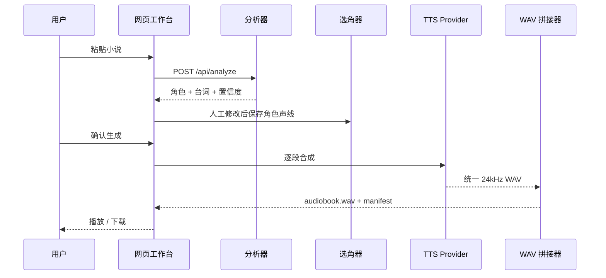

# 系统架构与数据合同

## 架构原则

1. **规则先行，模型补语义。** 引号和明确发言动词由确定性代码处理；别名与指代交给千问。
2. **不确定性是数据。** `confidence` 和 `evidence` 会进入 UI，不在后端静默吞掉。
3. **角色特质与台词情绪分开。** “温暖的成年女声”是角色基线，“愤怒”是当前一句的状态。
4. **LLM 不直接选择 voice ID。** 模型输出语义标签，由 `voices.py` 匹配供应商目录。
5. **真实 API 可拔插。** 业务管线只依赖 `TTSProvider.synthesize()`。
6. **先下载，再拼接。** 百炼返回的临时 URL 不作为项目长期资源。

## 请求链路



## 模块边界

### `analyzer.py`

输入：原始 UTF-8 文本。

输出：`AnalysisResult`。

职责：

- 规范换行；
- 识别引号内对话；
- 保留字符位置；
- 识别发言动词前后的候选人物；
- 生成本地置信度；
- 只在文本有证据时推断年龄和性别呈现。

### `qwen.py`

输入：原文 + 本地分段结果。

职责：

- 用 OpenAI 兼容 HTTP 接口请求严格 JSON；
- 让小说文本始终处于“数据”位置，系统提示不接受原文中的指令；
- 合并角色和 speaker assignment；
- 网络、鉴权或 JSON 失败时保留本地结果。

### `voices.py`

输入：角色的 `gender`、`age_group`、`traits`。

输出：固定目录中的 `voice_id`。

目录项同时保存：

- 应用内部 ID；
- 供应商 voice 参数；
- 模型兼容的性别与年龄；
- 浏览器试听的 rate / pitch；
- 离线诊断音频率。

所有 `provider_voice` 当前都属于 `cosyvoice-v3-flash`，禁止与其他模型混用。

### `providers/`

统一接口：

```python
synthesize(
    segment: ScriptSegment,
    character: CharacterProfile,
    voice: VoicePreset,
    output_path: Path,
) -> dict
```

- `DemoToneProvider`：全离线，不假装语音，只验证音频管线。
- `DashScopeTTSProvider`：百炼非实时 HTTP，一句一请求，立即下载 WAV。

### `audio.py`

- 合成前检查字符和片段限制；
- 创建隔离 job 目录；
- 校验所有 WAV 的通道、位深和采样率；
- 片段间插入 220ms 静音；
- 写入 `audiobook.wav` 与 `manifest.json`。

## 核心数据

### CharacterProfile

```json
{
  "id": "char_123",
  "name": "林夏",
  "gender": "unknown",
  "age_group": "unknown",
  "traits": ["轻柔"],
  "voice_id": "adult_f_soft",
  "confidence": 0.62,
  "evidence": ["林夏轻声说"]
}
```

`unknown` 是正常值。没有证据时不根据中文姓名强行推断性别或年龄。

### ScriptSegment

```json
{
  "id": "seg_004",
  "kind": "dialogue",
  "text": "总得有人把信送到。",
  "speaker_id": "char_123",
  "emotion": "neutral",
  "confidence": 0.92,
  "source_start": 56,
  "source_end": 65
}
```

### 输出目录

```text
data/outputs/<job_id>/
  audiobook.wav
  manifest.json
  segments/
    001_seg_001.wav
    002_seg_002.wav
```

该目录已加入 `.gitignore`。

## 下一轮技术改造

- 用堆栈解析嵌套和跨段引号；
- 增加角色 alias 图谱与人工 `locked` 字段；
- 将相邻同角色短句合并，降低 API 调用次数；
- 用内容哈希缓存未变化的片段；
- 加后台队列、任务进度和失败重试；
- 只重生成改过角色或文本的片段；
- 记录片段起止时间，生成 WebVTT / LRC；
- 输出 MP3、M4B 与章节元数据。

